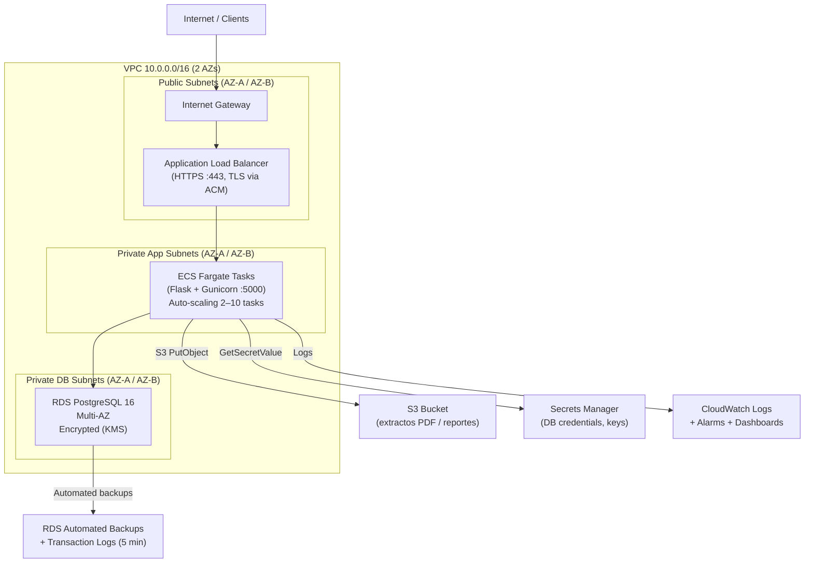

# Parte 3 – Arquitectura AWS

## 3.1 Diagrama de arquitectura



**Traffic flow:** HTTPS → ALB (TLS termination, WAF) → Gunicorn workers (Fargate) → RDS (private subnet, no internet route).

---

## 3.2 Infraestructura como Código (CloudFormation)

Fragmento ilustrativo en CloudFormation YAML — no necesariamente ejecutable; muestra la configuración clave de cada recurso.

```yaml
Resources:

  # ECS Task Definition – Flask app with Gunicorn
  FlaskTaskDefinition:
    Type: AWS::ECS::TaskDefinition
    Properties:
      Family: rombo-creditos
      RequiresCompatibilities: [FARGATE]
      Cpu: "512"
      Memory: "1024"
      ContainerDefinitions:
        - Name: flask-app
          Image: rombo-creditos:latest
          PortMappings:
            - ContainerPort: 5000
          # Non-sensitive config as environment variables
          Environment:
            - Name: FLASK_ENV
              Value: production
            - Name: USURY_RATE_EA
              Value: "0.2762"
          # Sensitive credentials pulled from Secrets Manager at runtime
          Secrets:
            - Name: DATABASE_URL
              ValueFrom: !Ref DBUrlSecret
            - Name: SECRET_KEY
              ValueFrom: !Ref AppKeySecret
          # Send logs to CloudWatch
          LogConfiguration:
            LogDriver: awslogs
            Options:
              awslogs-group: /ecs/rombo-creditos
              awslogs-region: us-east-1

  # RDS PostgreSQL – encryption at rest + automated backups
  PostgresDB:
    Type: AWS::RDS::DBInstance
    Properties:
      DBName: rombo_creditos
      DBInstanceClass: db.t3.medium
      Engine: postgres
      StorageEncrypted: true
      MultiAZ: true
      BackupRetentionPeriod: 7
      DBSubnetGroupName: !Ref PrivateSubnetGroup
      VPCSecurityGroups:
        - !Ref RDSSecurityGroup

  # Security Groups – least privilege: ALB → ECS → RDS
  ALBSecurityGroup:
    Type: AWS::EC2::SecurityGroup
    Properties:
      GroupDescription: ALB - accepts HTTPS from internet
      SecurityGroupIngress:
        - IpProtocol: tcp
          FromPort: 443
          ToPort: 443
          CidrIp: 0.0.0.0/0
      SecurityGroupEgress:
        - IpProtocol: tcp
          FromPort: 5000
          ToPort: 5000
          DestinationSecurityGroupId: !Ref ECSSecurityGroup

  ECSSecurityGroup:
    Type: AWS::EC2::SecurityGroup
    Properties:
      GroupDescription: ECS - only accepts traffic from ALB
      SecurityGroupIngress:
        - IpProtocol: tcp
          FromPort: 5000
          ToPort: 5000
          SourceSecurityGroupId: !Ref ALBSecurityGroup
      SecurityGroupEgress:
        - IpProtocol: tcp
          FromPort: 5432
          ToPort: 5432
          DestinationSecurityGroupId: !Ref RDSSecurityGroup

  RDSSecurityGroup:
    Type: AWS::EC2::SecurityGroup
    Properties:
      GroupDescription: RDS - only accepts traffic from ECS
      SecurityGroupIngress:
        - IpProtocol: tcp
          FromPort: 5432
          ToPort: 5432
          SourceSecurityGroupId: !Ref ECSSecurityGroup
```

---

## 3.3 Preguntas de arquitectura

### Pipeline CI/CD

Usaría GitHub Actions con las siguientes etapas: lint y format check con ruff, tests unitarios e integración con pytest, build de la imagen Docker y push a ECR, deploy automático a un ambiente de staging y smoke tests básicos. Para pasar a producción requeriría aprobación manual. Si algún alarm de CloudWatch se dispara post-deploy, se hace rollback automático.

### Estrategia de backups (RPO < 1h, RTO < 4h)

RDS tiene backups automáticos diarios y point-in-time recovery (PITR) usando los logs de transacciones, lo que permite restaurar a cualquier punto de los últimos 7 días con un RPO de minutos. Con Multi-AZ habilitado, si falla una zona de disponibilidad RDS promueve el standby automáticamente en menos de 2 minutos sin pérdida de datos. Eso cumple ampliamente RPO < 1h y RTO < 4h.

### Escalabilidad ante 10x de carga

ECS Fargate escala automáticamente según CPU o número de requests. Para picos grandes como cierre de mes, lo más importante sería mover el procesamiento de pagos a una cola SQS — el API recibe el pago, lo encola y responde inmediato, mientras workers separados procesan la cola. Así el API no se satura esperando que termine cada transacción. Para la BD, una read replica para las consultas del extracto ayudaría a no sobrecargar la instancia principal.

### Consideraciones de seguridad

- **Cifrado:** RDS con encripción en reposo, TLS en el ALB para datos en tránsito, credenciales en Secrets Manager en lugar de variables de entorno hardcodeadas.
- **Auditoría:** CloudTrail para todas las llamadas a la API de AWS, logs estructurados de la app en CloudWatch, tabla de auditoría en la BD con registro de cada cambio.
- **Cumplimiento:** Retención de registros financieros según la normativa colombiana, roles IAM con mínimo privilegio para cada servicio.
