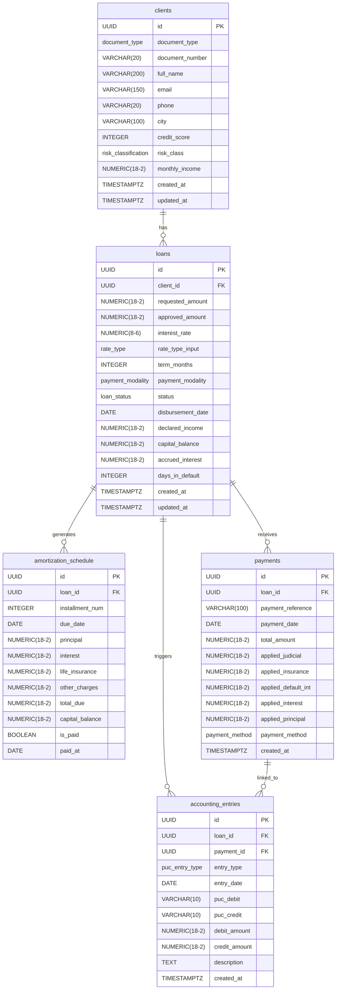

# ER Diagram – Sistema de Créditos de Consumo

Generated with [Mermaid](https://mermaid.js.org/). Paste into any Mermaid renderer or [mermaid.live](https://mermaid.live).

## Enum Types

| Type | Values |
|---|---|
| `document_type` | CC, CE, NIT, PASAPORTE |
| `risk_classification` | A (Normal), B (Aceptable), C (Apreciable), D (Significativo), E (Irrecuperable) |
| `rate_type` | NOMINAL_MV, EFECTIVA_ANUAL |
| `payment_modality` | CUOTA_FIJA, ABONO_CONSTANTE |
| `loan_status` | RADICADO, APROBADO, DESEMBOLSADO, AL_DIA, EN_MORA, REESTRUCTURADO, CASTIGADO, PAGADO |
| `payment_method` | PSE, CONSIGNACION, DEBITO_AUTOMATICO, CORRESPONSAL |
| `puc_entry_type` | DESEMBOLSO, CAUSACION_INTERESES, RECAUDO, MORA |
